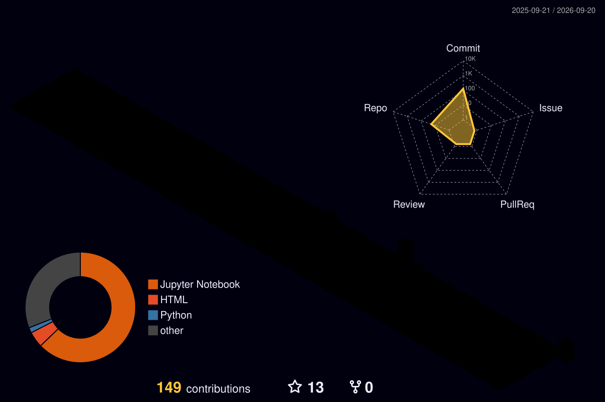

<p align="center">
<a href="https://www.linkedin.com/in/lubnashireenr"></a>
<a href="https://github.com/LubnaShireenR"></a>

</p>

B.Tech final-year student in Electronics & Communication Engineering with Data Science at SRM Institute of Science and Technology, currently working as a Data Analyst Intern. I build dashboards and run analysis that answer a real business question — not just "here's a chart," but "here's why."

<br clear="right"/>


<table>
<tr>
<td align="center" width="96">

<br><sub><b>Python</b></sub>
</td>
<td align="center" width="96">

<br><sub><b>Pandas</b></sub>
</td>
<td align="center" width="96">

<br><sub><b>NumPy</b></sub>
</td>
<td align="center" width="96">

<br><sub><b>MySQL</b></sub>
</td>
<td align="center" width="96">

<br><sub><b>Power BI</b></sub>
</td>
<td align="center" width="96">

<br><sub><b>Tableau</b></sub>
</td>
</tr>
<tr>
<td align="center" width="96">

<br><sub><b>Plotly</b></sub>
</td>
<td align="center" width="96">

<br><sub><b>Streamlit</b></sub>
</td>
<td align="center" width="96">

<br><sub><b>Jupyter</b></sub>
</td>
<td align="center" width="96">

<br><sub><b>Git</b></sub>
</td>
<td align="center" width="96">

<br><sub><b>GitHub</b></sub>
</td>
<td align="center" width="96">

<br><sub><b>Excel</b></sub>
</td>
</tr>
</table>

<p align="center"></p>


| Project | Description & Tech | Impact |
|---|---|---|
| 🏥 **HR Analytics — Employee Attrition** | **Stack:** `Streamlit` `Pandas` `Plotly`<br>Interactive dashboard digging into *why* people leave, not just that they do. | Turned a static HR export into a self-serve tool for spotting attrition risk by department and tenure. |
| 🛍️ **Global Retail Sales Analytics** | **Stack:** `Streamlit` `Pandas` `Plotly` `SQL`<br>Sales performance, profitability, and regional trend tracking. | Answers "why did Q3 dip in the South region" in two clicks instead of two meetings. |
| 📡 **Telecom Churn Prediction & Retention** | **Stack:** `Python` `Scikit-learn` `EDA`<br>Logistic Regression & Random Forest models trained on engineered churn features. | Flags likely churners before they leave, instead of explaining the loss after. |
| 🏦 **FinSight — Banking Executive Intelligence** | **Stack:** `Power BI` `SQL` `Python` `DAX`<br>Executive dashboard tracking conversions, campaigns, and banking KPIs. | Gives leadership one view of banking performance instead of five disconnected reports. |
| 🛡️ **CyberShield — Risk Intelligence Dashboard** | **Stack:** `Python` `SQL` `Power BI`<br>Tracks attack patterns, threat severity, and anomaly/network risk scores. | Surfaces the scary stuff on a dashboard before it becomes a headline. |
| 📦 **Supply Chain & Inventory Analytics** | **Stack:** `Power BI` `Python` `SQL` `DAX`<br>Inventory health, supplier efficiency, and delivery performance in one view. | Replaces manual spreadsheet tracking with a live operations control panel. |

<sub>Full list of repos and smaller EDA/SQL experiments → [github.com/LubnaShireenR](https://github.com/LubnaShireenR?tab=repositories)</sub>

<p align="center"></p>


<p align="center">

</p>

<details>
<summary><sub>One-time setup so this shows <i>your</i> real contribution data (2 minutes)</sub></summary>
<br>

This is generated by [`yoshi389111/github-profile-3d-contrib`](https://github.com/yoshi389111/github-profile-3d-contrib) — 1.7k stars, actively maintained, and it commits the image **directly into your own repo** rather than depending on someone else's live server. Once set up, it can't go down the way the shared badge services can.

**1.** In your `LubnaShireenR/LubnaShireenR` profile repo, create `.github/workflows/profile-3d.yml`:

```yaml
name: GitHub-Profile-3D-Contrib
on:
  schedule:
    - cron: "0 18 * * *"
  workflow_dispatch:
permissions:
  contents: write
jobs:
  build:
    runs-on: ubuntu-latest
    name: generate-github-profile-3d-contrib
    steps:
      - uses: actions/checkout@v5
      - uses: yoshi389111/github-profile-3d-contrib@latest
        env:
          GITHUB_TOKEN: ${{ secrets.GITHUB_TOKEN }}
          USERNAME: ${{ github.repository_owner }}
      - name: Commit & Push
        run: |
          git config user.name github-actions
          git config user.email github-actions@github.com
          git add -A .
          if git commit -m "generated"; then
            git push
          fi
```

**2.** Commit it, then go to **Actions → GitHub-Profile-3D-Contrib → Run workflow** to trigger it manually the first time.

**3.** It will create a `profile-3d-contrib/` folder in your repo with several style options (`profile-night-rainbow.svg`, `profile-green.svg`, `profile-gitblock.svg`, etc.) — the image above already points at the rainbow one. Browse the [style gallery here](https://github.com/yoshi389111/github-profile-3d-contrib#step-3-manually-run-this-github-action) if you want to swap styles.

Until step 2 is run once, the image above will show broken — that's expected, not an error.

</details>

---


<p align="center">

</p>

<details>
<summary><sub>Trophies not loading?</sub></summary>
<br>

This one's a known issue with the free shared instance — its own maintainer has publicly said it's overloaded with traffic and increasingly unreliable, independent of your username or my markdown. Two options:

1. **Just retry** — reload your GitHub profile page in a minute or two; it often recovers on its own.
2. **Permanent fix** — deploy your own free copy on Vercel (removes you from the shared rate limit entirely): click **[Deploy with Vercel](https://vercel.com/new/clone?repository-url=https://github.com/ryo-ma/github-profile-trophy)**, connect your GitHub account, and once it's live, swap the image URL above from `github-profile-trophy.vercel.app` to your own `https://your-deployment-name.vercel.app`.

</details>

---


<p align="center">

</p>

<details>
<summary><sub>One-time setup so this eats <i>your</i> real graph (2 minutes)</sub></summary>
<br>

Add `.github/workflows/snake.yml` to your `LubnaShireenR/LubnaShireenR` profile repo with:

```yaml
name: generate snake
on:
  schedule:
    - cron: "0 0 * * *"
  workflow_dispatch: {}
  push:
    branches: [ main ]
jobs:
  generate:
    permissions:
      contents: write
    runs-on: ubuntu-latest
    steps:
      - uses: Platane/snk@v3
        with:
          github_user_name: ${{ github.repository_owner }}
          outputs: dist/github-contribution-grid-snake-dark.svg?palette=github-dark
      - uses: crazy-max/ghaction-github-pages@v4
        with:
          target_branch: output
          build_dir: dist
        env:
          GITHUB_TOKEN: ${{ secrets.GITHUB_TOKEN }}
```

Commit it, let the Action run once (check the **Actions** tab), and the snake above will start eating your real green squares.

</details>

---


<p align="center">


</p>

<p align="center">

</p>

---


<p align="center">
<a href="mailto:you@example.com"></a>
<a href="https://www.linkedin.com/in/lubnashireenr"></a>
<a href="https://github.com/LubnaShireenR"></a>
</p>

<br clear="left"/>

<p align="center"><i>"Data doesn't lie. It just waits for someone to ask it the right question."</i></p>


